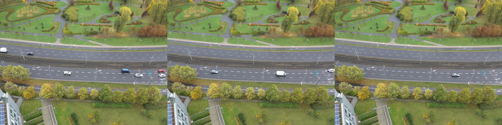
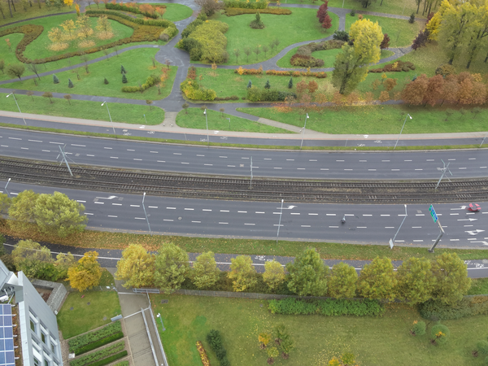
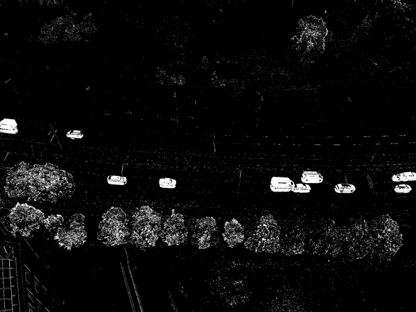
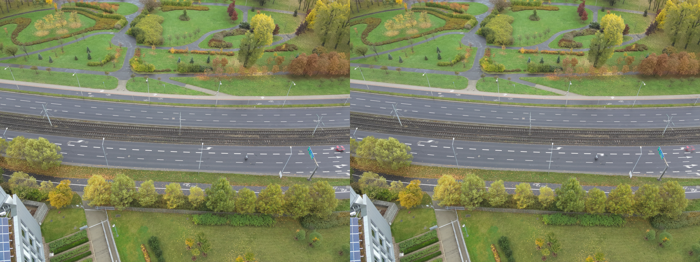
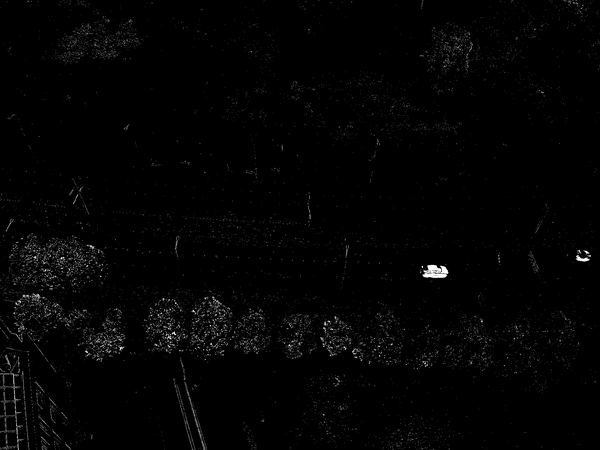
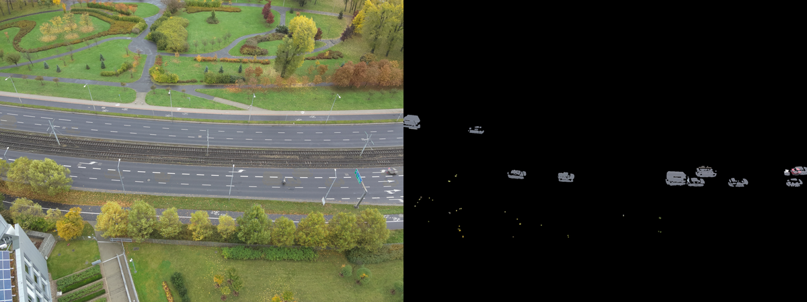
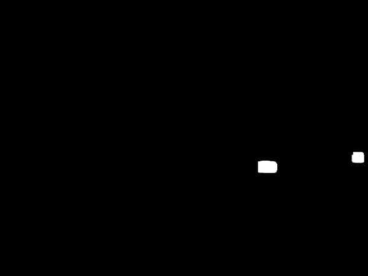
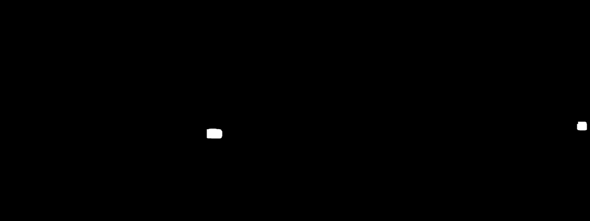

# Project I
**Author:** Samuel Janas (151927)

## Dataset
The images I got are as follows:

I've noticed right away that the main issue will concern the overlapping cars on the roads. All of the other differences were not that significant and are overlooked by human eye.

## First step
My first step was to find the areas that are the same across all of the images. Median blend proved to work great for this. I've used the following code:
```python
def median_blend(images):
    # Stack images along the third dimension
    stacked_images = np.stack(images, axis=-1)
    
    # Compute the median along the stack, resulting in the blended image
    blended_image = np.median(stacked_images, axis=-1).astype(np.uint8)
    
    return blended_image
```
The idea was to take the dominant values from all images and it sure worked. It resulted in small artifacts remainig. I've decided to use the median blend as a base for the rest of the project.


## Investigating the possibilities
To see what was possible and what wasn't I first looked at what is different in our image compared to the others. Here's the mask showing the results:


---

While writing the code for that I came across [this](https://pyimagesearch.com/2020/05/18/image-inpainting-with-opencv-and-python/) site. It gave me an idea to use the inpainting algorithm to fill the missing parts. The results were not that great, but it was slightly better

On the right you can see the use of inpainting compared to the median blend (left). Not much improvement, however the artifacts are slightly smaller/blurred.

---

I spent some more time looking at the input data and noticed that I could focus on the last image as it only has one car. I took a look at differences between the last image and the median blend and got the following mask:

**Remember about this step as it proved to be the key to my final solution**

---

I then experimented slightly with the first differences mask and after applying proper closing, I averaged the values from inside the mask and tried applying it on the median blend. The results were terrible unfortunately...


## Final solution
Coming back to the image I've mentioned to keep in mind. After applying proper closing and some dilation it looks much more helpful:

I've separated each mask into a different image and did two different things with them.


I thought of blending in GIMP/Photoshop and I had an idea to take pixels from around the mask, which would be similar to stamping. I did that and we were able to get rid of the first car:


I then used the last image from the output and the **second** mask to get rid of the red car.
The code for substituting the pixels was as follows:
```python
last_image = images[-1]

car_mask = artifact_masks[1]
border_mask = dilate(car_mask, kernel_size=30)
inversed_car_mask = cv2.bitwise_not(car_mask)

masked_image1 = cv2.bitwise_and(blended_image_cleaned, blended_image_cleaned, mask=inversed_car_mask)
masked_image2 = cv2.bitwise_and(last_image, last_image, mask=car_mask)

final_image = cv2.add(masked_image1, masked_image2)
```

The final result is as follows:
