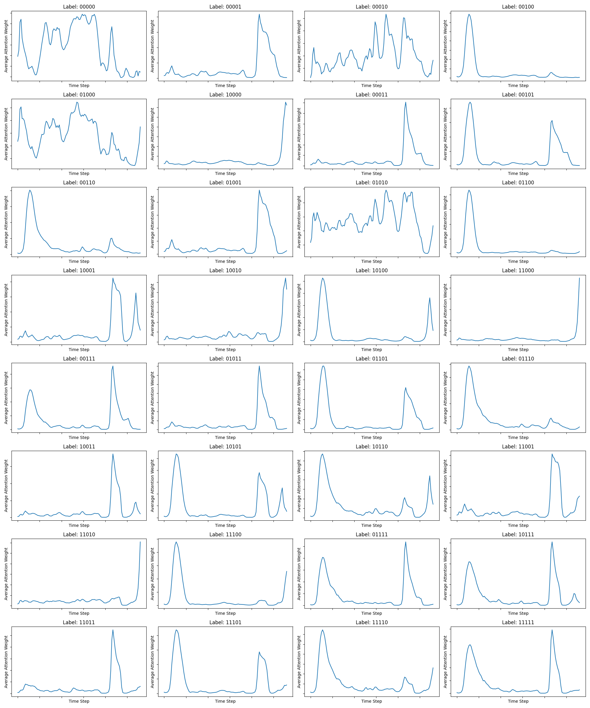

# Project I
Samuel Janas (151927)

## Preprocessing
In `data/generate_data.py` you can find the code to generate the data. The data is generated using the `generate_data` function. The function takes the number of samples as an argument, and creates a split of 80% training data and 20% test data.

To make sure that the input is consistent, we're adding the paddding to the input, each input is padded with 0's to the length of the longest input.

## Dependencies
As mentioned in the task, the problem is rather simple. To showcase my skills, I've used PyTorch (see `train.py` and `train_RCA.py` for training loops). The model uses configurable hyperparameters, they can be found in `config/train.yaml` - I'm using Hydra to manage the configuration. The model is defined in `model/HomeBrewRNN.py`.

## Results
The model trained for ~7 epochs achieves over 99% accuracy on the test set. It can be improved further by either training for more time or tweaking the hyperparameters.
run `python -m evals.evaluate` to evaluate the model.

As for the RCA. I had no pair for this project and couldn't consult if my idea was correct. Here's the plot and my understanding behind it:

The chart here shows the values from attention block that I've put in the model. You can find the details in `evals/evaluate_attention.py`. I'm showing the values for each combination of classes. The higher the value, the more the model is paying attention to the given interval, this way we can see what is important for each defect.

