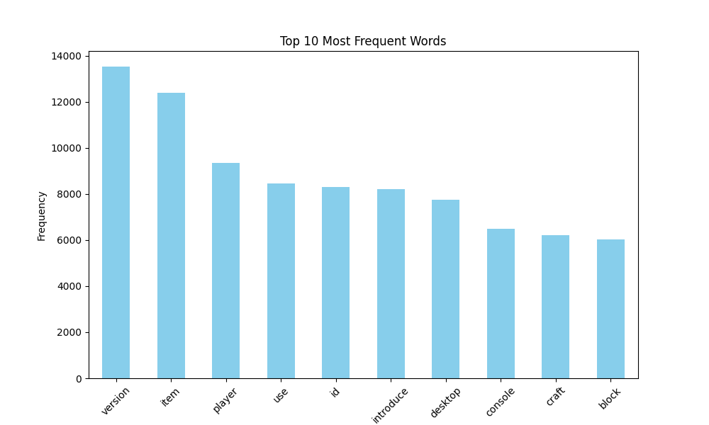
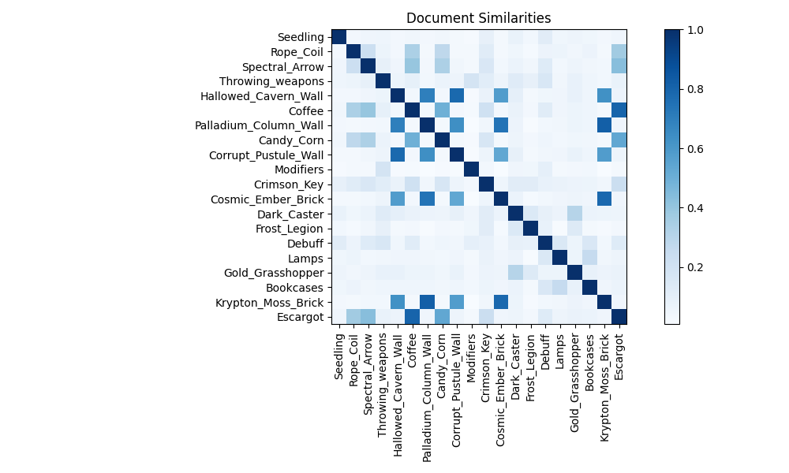

<style>
    /* CSS styles for the report */
    #report-info {
        text-align: center;
        margin-bottom: 50px;
    }

    #title {
        font-size: 30px;
        font-weight: bold;
    }

    #authors {
        font-size: 20px;
    }

    #date {
        font-size: 20px;
    }

    #report-content {
        margin: 0 auto;
        width: 65%;
        /* justify */
        text-align: justify;
    }

    /* nicer for the eye background */
    body {
        background-color: #f5f5f5;
    }

</style>
<div id=report-info>
    <p id="title">Wiki Fandom Recommender System</p>
    <p id="authors"><strong>Authors:</strong> <i>Samuel Janas 151927, Michał Skrzypek 151766</i></p>
    <p id="date"><strong>Date:</strong> 05.11.2023</p>
</div>

--- 
<div id=report-content>

## Goal
Our project aims to create a recommendation system for similar articles based on users' previously visited articles in an effective and ethical way. The system comprises several key components: web scraping and crawling, text preprocessing, content similarity calculation, and article recommendations.

## Data Collection (Crawling and Scraping)
The data collection process involves scraping content from fandom website about computer game Terraria. We choose this fandom Wikipedia because Terraria is superb.
```python
# config.py
BASE_URL = 'https://terraria.fandom.com'
START_URL = 'https://terraria.fandom.com/wiki/Terraria_Wiki'
MAX_DEPTH = 4
MAX_ARTICLES = 2000
SLEEP_TIME = 0.3  # Time to sleep between scraping requests (in seconds)

CSV_FILE_PATH = "csv/preprocessed_articles.csv"
```
<!-- <!-- paste config file here> -->
Configuration parameters such as base, start URLs and the number of articles that we want to scrape are provided. We defined sleep rule to avoid  excessive and rapid requests that could overload the website's server, resulting in getting our IP address banned. Parameter ```MAX_DEPTH``` limits the depth of web page traversal during the web scraping process. The value was set arbitrarilly to 4, overall it's used to avoid infinite loops and get the links. The ```MAX_ARTICLES``` parameter limits the number of articles that we want to scrape. The ```CSV_FILE_PATH``` parameter defines the path to the file where the scraped data will be stored.


### Scraping
With a set `VISITED_LINKS = set` we keep track of already visited links so none of them overlap. We store scraped data in list called `articles`. 
#### Robots.txt
Functions `fetch_robots_txt, parse_robots_txt, can_visit_url` retrieve content of the file robots.txt then parse it and extract “Allow”/”Disallow” rules.
```python
# scraper.py
def fetch_robots_txt():
    url = f"{BASE_URL}/robots.txt"
    response = requests.get(url)
    return response.text

def parse_robots_txt():
    rules = {"Allow": [], "Disallow": []}
    try:
        robots_txt = fetch_robots_txt().split("\n")
        user_agent = None
        for line in robots_txt:
            if line.startswith("User-agent:"):
                user_agent = line.split(":")[1].strip()
            elif user_agent == "*" or user_agent == "MyBotName":  # Adjust "MyBotName" to the name of your bot (if it has one)
                if line.startswith("Allow:"):
                    rules["Allow"].append(line.split(":")[1].strip())
                elif line.startswith("Disallow:"):
                    rules["Disallow"].append(line.split(":")[1].strip())
    except Exception as e:
        print(f"Error parsing robots.txt: {e}")
    return rules  # Moved this return statement out of the try block.
```

This part ensures that we crawl through the website ethically and for instance we don’t scrape data about users.
#### Actual scraping
With `get_links_from_url` we extract all links from a given URL and then we know next websites to visit. To ensure that we don't fall into infinite loops and introduce a schema to our scraping we used a DFS crawling method.  The `dfs_crawl` function performs a recursive depth-first traversal of the website. If the content of a page is successfully scraped, it is appended to the articles list.
```python
def dfs_crawl(url, visited_links, articles, depth=0, rules=None):
    from config import MAX_DEPTH, MAX_ARTICLES

    if depth == MAX_DEPTH or len(articles) >= MAX_ARTICLES:
        return
    
    if url in visited_links or (rules and not can_visit_url(url, rules)):
        return
    
    visited_links.add(url)

    print(f"Visiting {url} at depth {depth}")

    content = scrape_content_from_link(url)
    if content:
        articles.append({
            'link': url,
            'content': content
        })

    for link in get_links_from_url(url, rules):
        dfs_crawl(link, visited_links, articles, depth + 1, rules=rules)
        if len(articles) >= MAX_ARTICLES:
            break
    time.sleep(SLEEP_TIME)
```

We consider links starting with the `BASE_URL` only.  The `scrape_content_from_link` scrapes the main content from a given URL according to the websites' layout we inspected earlier.
```python
def scrape_content_from_link(url):
    try:
        page = requests.get(url)
        soup = BeautifulSoup(page.content, 'html.parser')

        # We assume the main content is in a <div> with class "mw-parser-output"
        content_div = soup.find('div', class_='mw-parser-output')

        if content_div:
            return content_div.get_text()
        else:
            return None
    except Exception as e:
        print(f"Error scraping {url}: {e}")
        return None
```

## Preprocessing
To preprocess the data we utilized Natural Language Toolkit and applied standard techniques. Before applying them however, we ensured that the data is in the correct format; that is, we converted all characters to lowercase with `content = content.lower()`.
The following steps were performed:
- **Tokenization:** breaking the article content into sentences and further into separate words. Smaller units are easier to process and analyze.
```python
# Tokenize the content into words
sentences = sent_tokenize(content)
tokens = [word_tokenize(sent) for sent in sentences]
words = [word for sublist in tokens for word in sublist]
```
- **Removing Stopwords and non-alphabetical tokens:** This step improves the quality of the data. Stopwords (e.g., the, I, in, and, is) and non-alphabetical tokens (e.g., punctuation) are typically not informative so we removed them to clean the data.
```python
 # Remove stopwords and non-alphabetical tokens for cleaner preprocessing
words = [word for word in words if word not in stop_words and word.isalpha()]
```
- **POS tagging and Lemmatization:** Tagging the words ensures that the lemmatizer understands the correct part of speech for each word. Lemmatization reduces words to their base or dictionary form. That in turn reduces the number of unique words and makes the data more consistent, thus easier to analyze/make recommendations.
```python
    # Get POS tagging for the words
    nltk_pos = nltk.pos_tag(words)
    wordnet_pos = [nltk_pos_to_wordnet_pos(pos) for _, pos in nltk_pos]

    # Apply lemmatization
    lemmatized_words = [lemmatizer.lemmatize(word, pos) for word, pos in zip(words, wordnet_pos)]

    preprocessed_content = ' '.join(lemmatized_words)
```
After the above steps, the data is returned in the form of a dict, with a key-value pair of the article link and its preprocessed content.
```python
    return {
        'link': link,
        'content': preprocessed_content
    }
```
We save the returned dict to a CSV file to avoid having to repeat the process every time we want to make recommendations. The CSV file is then used as the input for the recommendation system.
```python
    df = pd.read_csv(CSV_FILE_PATH)
    preprocessed_articles = df.to_dict(orient='records')

    # ...

    # For demonstration, let's use the links of the first 5 articles as input_articles_links
    input_articles_links = [article['link'] for article in preprocessed_articles[:5]]

    recommendations = similarity.get_recommendations(preprocessed_articles, input_articles_links, top_n=5)
```

## Similarity Calculation & Recommendations
We use *“Term Frequency-Inverse Document Frequency”* because this technique takes into account two crucial factors:
- how often a term appears in a document,
- how unique a term is across documents.

> An interesting observation about recommendations for game related content is that there are some keywords that have very distinct meaning, e.g. “boss” or “item”. We can use this to our advantage and recommend articles that have similar keywords.

The next step is converting the article content into TF-IDF vectors and then matrix. We calculate the similarities with cosine-similarity formula. It calculates the cosine of the angle between vectors and recommends `top_n`(a variable of our choosing) with the best score.


<!-- TODO here: -->
## Recommendations and their evaluation
A good starting point to showcase that our recommendations actually work would be to show some statistics about our data:
- Number of articles: 2000
- Number of unique words: 31523 (after preprocessing)
- Ten most common words:
 
 They all more or less make sense, we could delete some of them, but since we're using TF-IDF, it's not necessary. 'Version' is a words that occurs on every page multiple times, it's all over the changes that happened to the game. both 'item' and 'player' makes sense, most of the wiki is about items and everything in the game is somehow related to the player. All of the other most common words are mainly technicalities of the game, like 'craft' or 'block'.
 - 20 randomly chosen articles and their similarities:
    
    Some similarities are quite high! Let's explain some of them:
    
    Let's take a closer look at 'Coffee' and 'Escargot' articles. They both are food items, so it makes sense that they are similar. Each item of 'food' type in terraria grants some buffs that are sometimes specific to foods.

    There are some similarities like 'Palladium Column Wall' and 'Krypton Moss Brick'. They are both blocks. Blocks are placable items, they serve as either the terrain to move around or as a building material for decorations. Most of the other similarities in the chart are related to blocks as they make of the majority of the game's content.

#### Output of our program:
After running our program with
```bash
python project.py --read-csv
```
the output that you should expect is:
```bash
Based on https://terraria.fandom.com/wiki/Death, we recommend https://terraria.fandom.com/wiki/Death#Death_Messages with a score of 1.0
Based on https://terraria.fandom.com/wiki/Death, we recommend https://terraria.fandom.com/wiki/Status_messages with a score of 0.43443073828608725
Based on https://terraria.fandom.com/wiki/Death, we recommend https://terraria.fandom.com/wiki/Status_message with a score of 0.43443073828608725
Based on https://terraria.fandom.com/wiki/Death, we recommend https://terraria.fandom.com/wiki/Chat with a score of 0.3544553584480406
```
To explain this example: we recommend articles that are similar to the article about death. The first one is about death messages, which are messages that appear when you die. The second one is about status messages, which are messages that appear when you do something, like when you slay a boss, but when playing on multiplayer additional message about players death is displayed. And so on.

</div>